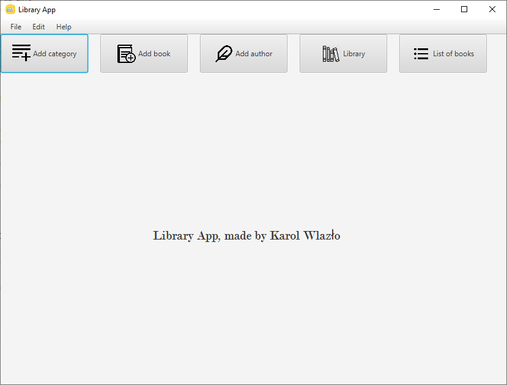
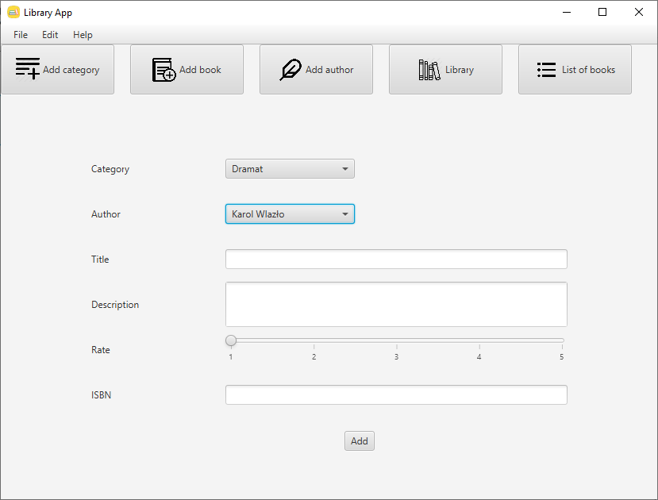
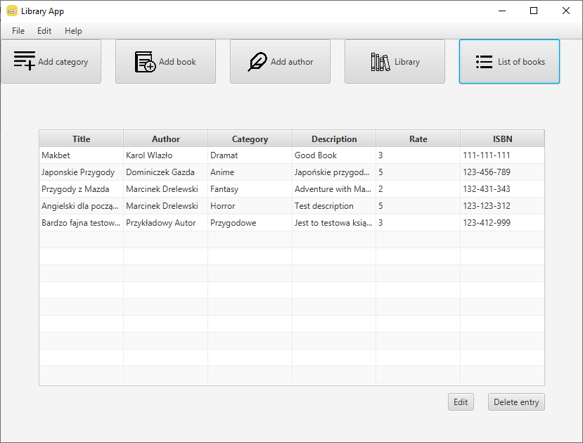

# LibraryApp
**Simple Library App created with Java 11, JavaFX 11 and H2 Database**
## Table of contents
* [General info](#general-info)
* [Technologies](#technologies)
* [Setup](#setup)
* [Features](#features)
* Screenshots(#screenshots)

## General info
This project is simple library app to menage books.

## Technologies
Project is created with:
* Java version: 11.0
* JavaFX version: 11.0
* H2 Database version: 1.4.200

## Setup
To open and run this project, download this respository to one folder and then open folder using e.g. IntelliJ, then run Main class.

## Features
* Add/Delete category/book/author from database
* Edit selected book
* Browse exist books in database (possibility sort books by category)

# Screenshots

